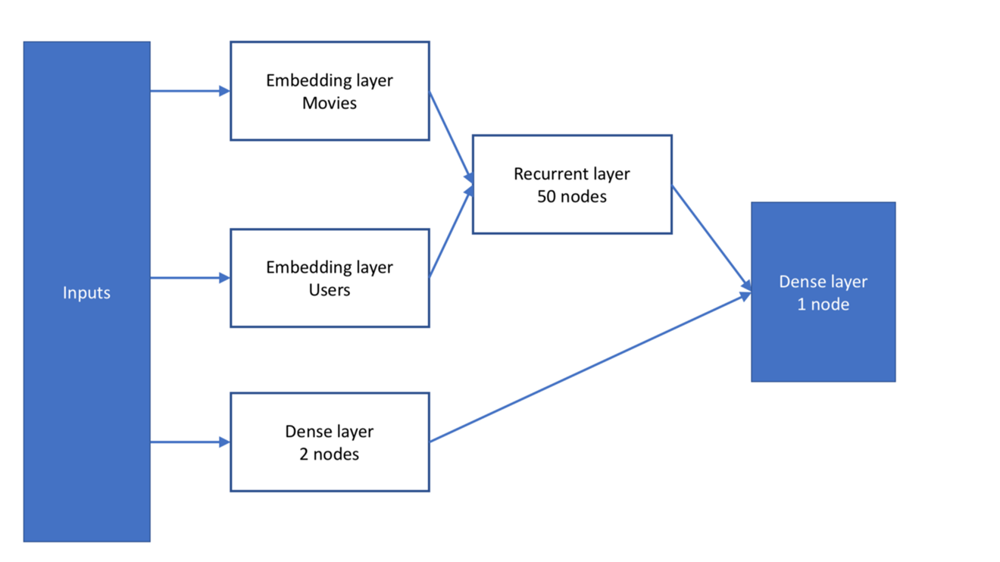

# Neural-Reccomender-system

Built a whole pipeline of recommender systems comprising of Popularity based recommender, KNN similarity based Clustering recommender, Item-Item association based recommender, Bi-Partite graph based association recommender, Neural Graph based Collaborative Filtering and Neural Embedding based Collaborative filtering. These models were built to work on three different datasets namely Amazon Book Dataset, Movie Lens Dataset and a Supermarket user-item interaction dataset.

# Brief about few types of Recommenders from the Piepline

1. The piepline includes a simple popularity based recommender which takes into account the transaction frequency of each item. We then predict the Top-k in terms of frequency of occurrence as recommendations. We have more complicated metrics to sort out the Top-k items. Given that we have Quantity and Price data with us, we can try out Total amount spent as measure for sorting the items. This recommender helps us tackle the “cold-start” problem. 

2. The pipeline includes a Co-clustering algorithm based recommender built using the Scikit-Surprise package. There were options to use either cosine similarity or Pearson similarity based collaborative filtering recommender, both of which were built using the Turicreate package. 

3. Neural embedding is one of the most suitable ways for handling Sparse Data. Given a set of users and items. We can learn a supervised algorithm which Provides us with rating of the item using embedding representation of User and the item.Machine learning approaches differ from this approach from the fact that , there we will have to have extracted features prior to executing a model

4. In case of Bipartite Graph based Recommenders, the items are considered as nodes and are given edge weights depending on their co-occurrence frequency. We use Louvain modularity technique to split the items into different communities.The number of communities obtained is dependent on the resolution used. Depending on the number of recommendations required for each user, we can modify the resolution to cater to that. 

   

## Key Contributions

1. Machine algorithms used for traditional collaborative filtering is not very efficient in handling sparse data.The Neural Embedding based recommender was built specially for handling sparse input data. We observe from the results that Matrix Factorization methods are being outperformed by the Embedding based Recommenders.
2. The Bi-Partite graph based association recommender was used for considering co-occurrences among items and to consider higher order proximities among the items. The Bi-partite graph based recommenders were built using Louivan community partition and Apriory algorithms.

## People

This work has been developed during a internship as a Data Scientist Intern by [Anirudh Sriram](https://github.com/anirudhs123) from Indian Institute of Technology, Madras. Ask us your questions at [anirudhsriram30799@gmail.com](mailto:anirudhsriram30799@gmail.com).
